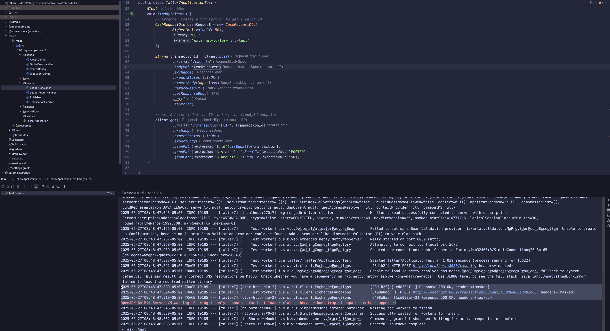
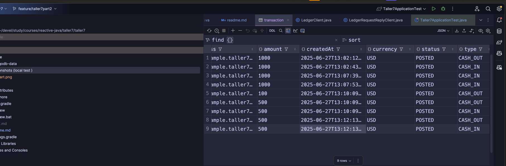

# for this study project i used the following resources:

# Podman and MongoDB and RabbitMQ
## Run MongoDB with Podman

```sh
podman  machine start
```

```sh
podman start  mongo
```
#Optional clean start 
#podman stop  mongo
#podman rm  mongo
#podman run --name mongo -d -p 27017:27017 -v $(pwd)/mongodb-data:/data/db mongo:latest

```sh
podman start  rabbitmq-stack
```
#Optional clean start 
#podman stop  rabbitmq-stack
#podman rm  rabbitmq-stack
#podman run --tls-verify=false -d --hostname my-rabbit --name rabbitmq-stack -p 5672:5672 -p 15672:15672 rabbitmq:3-management
# Local Test Screenshots

Below are screenshots from local tests:



